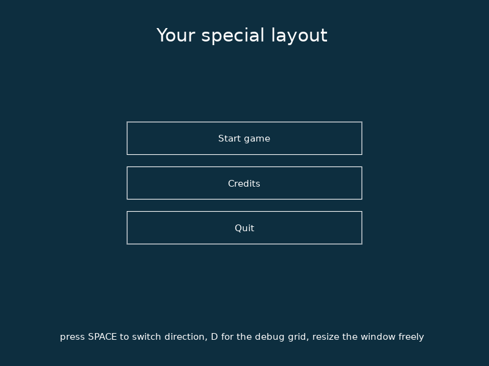
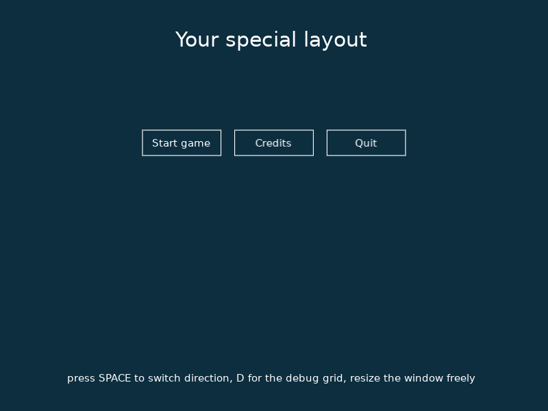
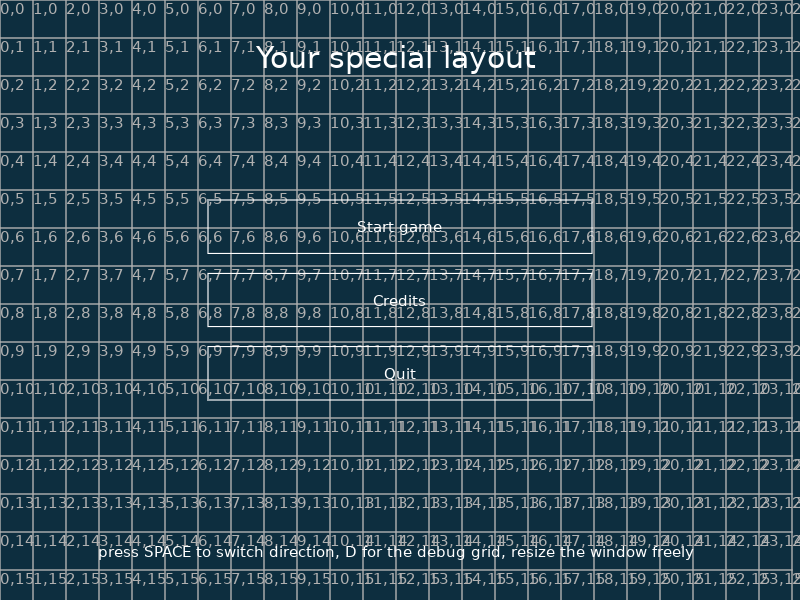

# Layouter

Layouter is a simple **UI grid layout library** for LÖVE 2D game engine.

It currently supports these element types:

- text (including spacer = blank text)
- text button
- image

## Requirements & installation

- LÖVE 11.4 or newer
- no dependencies

Copy `layouter.lua` into your project and require it:
```lua
local layouter = require 'layouter'
```

> **Colors are byte values (0-255), not LÖVE's 0-1 floats.**
> `{255, 255, 255}` is white, `{13, 46, 63}` is dark blue. Layouter converts them internally
> (`love.math.colorFromBytes`), so passing `{1, 1, 1}` gives you almost black, not white.

## Screenshots

Vertical and horizontal layouts of the same elements (`test/main.lua`):




Debug mode (`debug = true`) draws the grid with cell coordinates:



## How the layout works

Every element is either **automatic** or **fixed**:

- **automatic** - no `x`, `y`, `column` or `row` is given. Layouter positions and sizes it for you.
  All automatic elements share the available space equally, stacked in the layout `direction`.
- **fixed** - `x`/`y` (or `column`/`row`) is given. The element is drawn exactly there, keeps its own
  size, and does not take any space away from the automatic elements.

Both kinds can be mixed freely in one layout - a fixed title plus an automatic menu below it, for example.

`prepare()` is what turns added elements into positioned ones, so it has to run before `draw()`.
`replace()` and `remove()` call it for you.

## Usage

### 1. Include layouter
```lua
local layouter = require 'layouter'
```

### 2. Initialize layouter
Defaults = 15px font, white background, black color, debug disabled:
```lua
layouter.initialize()
```
or with a custom look (font = 20px, background = black, color = white, debug mode enabled = draw grid):
```lua
layouter.initialize({font = love.graphics.newFont(20), background = {0, 0, 0}, color = {255, 255, 255}, debug = true})
```
`initialize()` reads the current window size, so call it after `love.window.setMode()`.
`layouter.debug` can also be toggled at any time later.

### 3. Add elements to your layout
#### Text element
```lua
layouter.add('Hello world!')
```
#### Text element with options
```lua
layouter.add({content = 'Second text paragraph', font = love.graphics.newFont(50), color = {13, 46, 63}})
```
#### Spacer (blank paragraph)
```lua
layouter.add()
```
#### Image with custom key (key can be used to replace or remove it later)
```lua
layouter.add({content = love.graphics.newImage('logo.png'), type = 'image', key = 'logo'})
```
Images are drawn untinted. If you set `width`/`height`, the image is scaled to that size.
#### Button
```lua
layouter.add({content = 'Start game', type = 'button', callback = function() startGame() end})
```
A button draws as an outlined box and inverts its `color`/`background` while the mouse hovers over it.
#### Button that replaces itself on a click with a text
Note the automatically assigned key `eastereggs` that is created from the text.
```lua
layouter.add({content = '* easter! Eggs $@', type = 'button', callback = function() layouter.replace('eastereggs', 'Currently does nothing.') end})
```

#### Keys
Every element has a key, used by `replace()` and `remove()`. If you do not pass one, it is derived from the
content (lowercased, only `a-z0-9_` kept) and made unique automatically - a second `Hello world!` becomes
`helloworld2`. Elements without usable text content (spacers, images) fall back to their type: `text`, `image`,
`button`, `text2`, ... `add()` returns the key, so you never have to guess it:
```lua
local key = layouter.add('Hello world!') -- key == 'helloworld'
layouter.replace(key, 'Goodbye!')
```

#### Alignment
Text and buttons are centered by default; `align` accepts any LÖVE alignment
(`left`, `center`, `right`, `justify`):
```lua
layouter.add({content = 'Left aligned paragraph', align = 'left'})
```
Content is also vertically centered inside the element box, wrapped multi-line text included.

#### Element options
| option | default | meaning |
| --- | --- | --- |
| `content` | `''` | text string, or an `Image` for `type = 'image'` |
| `type` | `'text'` | `text`, `button` or `image` |
| `key` | derived from content | identifier for `replace()` / `remove()` |
| `font` | font from `initialize()` | LÖVE `Font` object |
| `color` | color from `initialize()` | text/border color, `{r, g, b}` in 0-255 |
| `background` | background from `initialize()` | button fill color while hovered, `{r, g, b}` in 0-255 |
| `align` | `'center'` | `left`, `center`, `right`, `justify` |
| `callback` | `false` | function called on click (buttons) |
| `group` | none | name of the row/column this element belongs to (see below) |
| `x`, `y` | automatic | fixed pixel position |
| `width`, `height` | automatic | fixed pixel size |
| `column`, `row` | automatic | fixed position in grid cells (see below) |
| `column_span`, `row_span` | `1` | size in grid cells |

### 4. Prepare your layout
Set where to draw your elements, whether they should be laid out horizontally or vertically, and whether auto
spacing (based on the number of elements) should be done.
```lua
layouter.prepare({x = layouter.COLUMN6, y = layouter.ROW4, direction = 'vertical', spacing = 'auto'})
```

#### Layout options
| option | default | meaning |
| --- | --- | --- |
| `x`, `y` | `0` | where the layout starts |
| `direction` | `'vertical'` | `vertical` stacks elements downwards, `horizontal` places them in a row |
| `spacing` | from `x`/`y` to the window edge | the area the automatic elements share; `'auto'` centers them by leaving the same gap on the opposite side as before `x`/`y`, or pass an explicit `{width = ..., height = ...}` |
| `padding` | `10` | gap in pixels around each element |
| `overflow` | `'none'` | `'wrap'` breaks a row/column into more rows/columns instead of squeezing elements below the minimum |
| `min_width` | none | smallest element width in a horizontal layout, wrapping happens below it |
| `min_height` | one line of text plus padding | smallest element height in a vertical layout, wrapping happens below it |

Calling `prepare` again only changes what you pass in - everything else is kept from the previous call:
```lua
layouter.prepare({direction = 'horizontal'}) -- same x, y, spacing and padding as before
```
`layouter.reset()` clears the elements and this remembered state.

### Tracks: multiple rows and columns
Automatic elements are laid out in **tracks** - a track is one row in a horizontal layout, one column in a
vertical one. By default there is a single track and all elements share it, which is what a layout with a
handful of elements wants.

#### Overflow: wrapping into more tracks
With `overflow = 'wrap'`, a track that would squeeze its elements below the minimum size is split into as many
tracks as needed, and the tracks are balanced so the last one is not left with a single element:
```lua
layouter.prepare({direction = 'horizontal', overflow = 'wrap', min_width = 150})
```
In a vertical layout the minimum defaults to one line of text plus padding, so elements never become
unreadably short:
```lua
layouter.prepare({direction = 'vertical', overflow = 'wrap'})
```
Nothing is ever clipped - if even the wrapped tracks do not fit into the available space, they simply run over
and `layouter._overflowing` is set to `true`.

#### Groups: adding elements into an existing row/column
Elements sharing a `group` are laid out in one track of their own, in the order the groups first appear.
`layouter.addTo(group, element)` is `add()` with a group:
```lua
layouter.addTo('menu', {content = 'Start game', type = 'button', callback = startGame})
layouter.addTo('menu', {content = 'Credits', type = 'button', callback = showCredits})
layouter.addTo('footer', 'v1.0')
```
Adding another element into an existing group later puts it into that same row/column, the rest of the row is
resized to make space for it:
```lua
layouter.addTo('menu', {content = 'Quit', type = 'button', callback = love.event.quit})
layouter.prepare()
```
Ungrouped elements share one implicit track. A group wraps like any other track. Fixed elements
(`x`/`y`/`column`/`row`) are not part of any track and ignore `group`.
Every prepared element carries its `group` and its `track` number, e.g. `layouter._layout[1].track`.

### 5. Draw your layout
```lua
function love.draw()
    layouter.draw()
end
```
`draw()` clears the screen with the layout background, so it should come first in `love.draw()`.

### 6. Process mouse clicks for buttons
This function needs to be called to enable interaction for buttons.
```lua
function love.mousepressed(x, y, mouse_button, is_touch)
    layouter.processMouse(x, y, mouse_button, is_touch)
end
```

### Grid positioning - columns and rows
The grid comes with 24 columns and 16 rows (`layouter.COLUMNS`, `layouter.ROWS`).
Layouter automatically calculates sizes of columns and rows (`layouter.COLUMN_WIDTH`, `layouter.ROW_HEIGHT`)
and generates helper variables.
You can use these helper variables to position your elements and layout easily:
```lua
-- columns:
layouter.COLUMN1 -- first column's right side, i.e. will position element right after first column
-- ...
layouter.COLUMN8 -- X position after width of eight columns

--- rows:
layouter.ROW1 -- Y position after height of a first row
-- ...
layouter.ROW4 -- Y position after height of four rows
```

### Grid positioning - placing elements into cells
Elements can also be placed into the grid directly. `column`/`row` are offsets counted in cells and mean exactly
the same as the constants above (`column = 6` is the same X as `layouter.COLUMN6`, `column = 0` is the left edge).
`column_span`/`row_span` are the size of the element, also counted in cells:
```lua
layouter.add({content = 'Title', column = 3, row = 2, column_span = 8, row_span = 2})
-- identical to:
layouter.add({content = 'Title', x = layouter.COLUMN3, y = layouter.ROW2,
              width = layouter.COLUMN_WIDTH * 8, height = layouter.ROW_HEIGHT * 2})
```

### Window resizing
Call `layouter.resize()` from `love.resize()` to recalculate the grid and reflow the layout:
```lua
function love.resize(width, height)
    layouter.resize(width, height)
end
```
The grid shortcuts (`layouter.COLUMN6`, ...) change with the window size, so elements positioned with them
need to be added again after a resize.

## API reference

| function | description |
| --- | --- |
| `layouter.initialize(options)` | set up fonts, colors, debug mode and calculate the grid |
| `layouter.add(element)` | add an element, returns its key |
| `layouter.addTo(group, element)` | add an element into a group, i.e. into an existing row/column, returns its key |
| `layouter.replace(key, element)` | replace every element with that key, keeping the key, and reflow |
| `layouter.remove(key)` | remove every element with that key and reflow |
| `layouter.reset()` | remove all elements and forget the remembered layout options |
| `layouter.prepare(layout)` | position and size the elements; merges with the previous call |
| `layouter.draw()` | clear the screen and draw the prepared layout, call from `love.draw()` |
| `layouter.processMouse(x, y, mouse_button, is_touch)` | fire button callbacks, call from `love.mousepressed()` |
| `layouter.resize(width, height)` | recalculate the grid and reflow, call from `love.resize()` |

| field | description |
| --- | --- |
| `layouter.COLUMNS`, `layouter.ROWS` | grid size, 24 x 16 |
| `layouter.COLUMN_WIDTH`, `layouter.ROW_HEIGHT` | cell size in pixels, calculated from the window |
| `layouter.COLUMN1` ... `COLUMN24`, `ROW1` ... `ROW16` | pixel positions of column/row edges |
| `layouter.debug` | draw the grid overlay, can be toggled at runtime |
| `layouter.font`, `layouter.color`, `layouter.background` | defaults used by elements that do not set their own |
| `layouter.elements` | the added elements |
| `layouter._layout` | the prepared (positioned) elements, each with its `group` and `track` number |
| `layouter._overflowing` | `true` when the prepared elements do not fit into the available space |

## Limitations

- only the default (usually left) mouse button triggers callbacks, on press
- no keyboard navigation and no touch handling
- buttons have a hover state but no pressed or disabled state
- one layout with one direction at a time: groups give you several rows (or several columns), but not rows
  and columns at once - mixed-direction layouts have to be built with fixed positions
- elements are not clipped or scrolled - content larger than its box overflows

## Tests

`test/` contains a LÖVE demo app and a headless unit test suite.

The demo shows a fixed title plus an automatic menu group. SPACE switches direction, W toggles overflow
wrapping, A adds another element into the menu, R removes the last one and D toggles the debug grid:
```
love test
```
The unit tests need only the `lua` interpreter - no window, no GPU:
```
lua test/spec.lua
```

## License

GNU LGPL 3.0, see [LICENSE](LICENSE). © Daniel Duris, dusoft@staznosti.sk, 2023+
